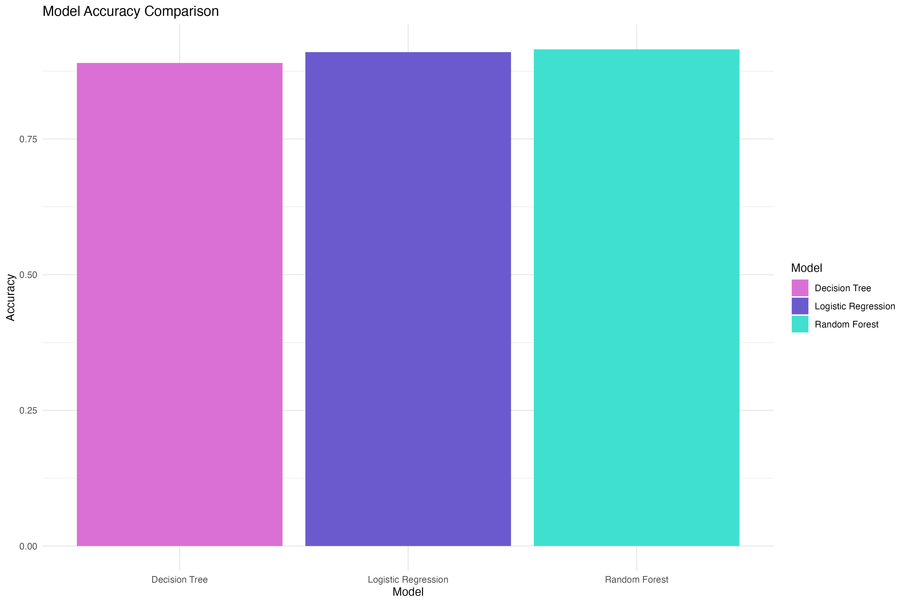
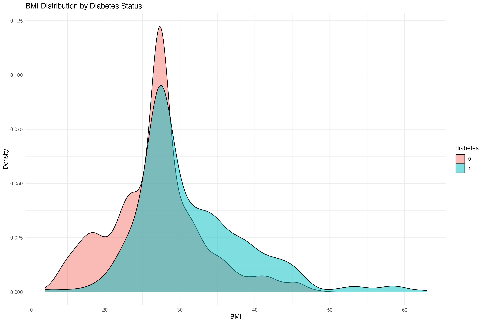
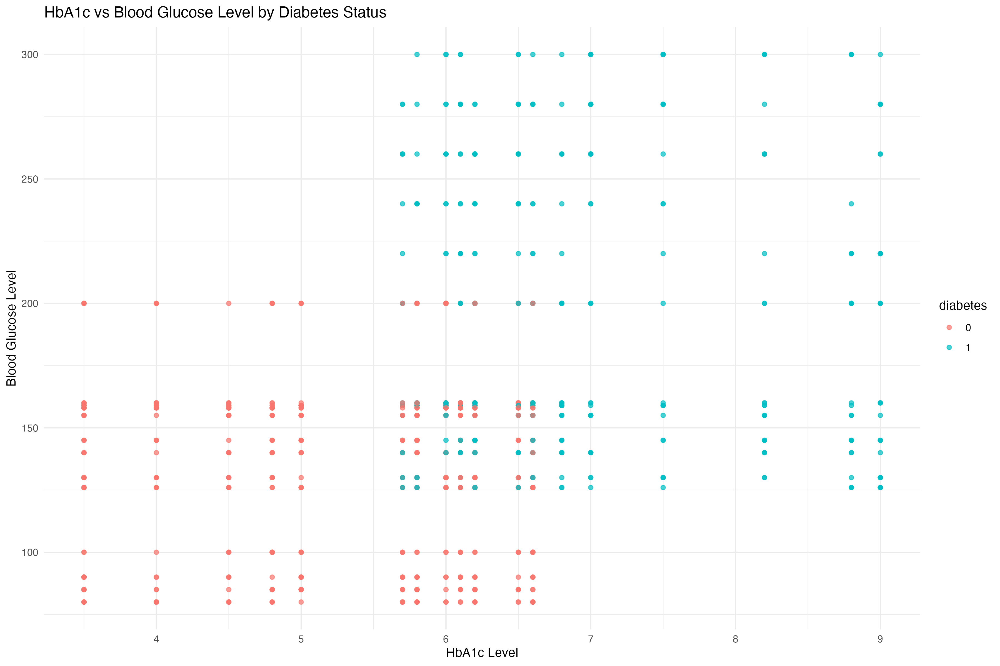
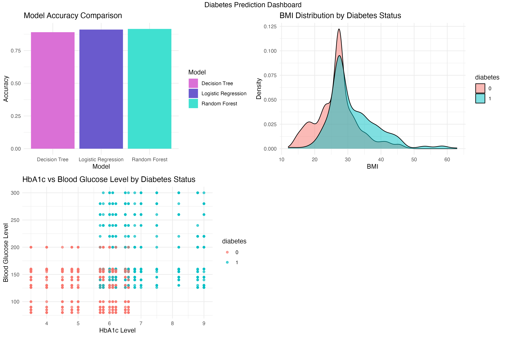

# STA309-Final: Diabetes Prediction Project

**Author:** Hera Dashnyam  
**Date:** December 10, 2024  

---

## Overview

This repository contains the final project for STA309, focusing on diabetes prediction using statistical and machine learning models. The goal is to analyze the relationships between patient attributes (e.g., BMI, glucose, HbA1c levels) and diabetes status, while comparing the performance of logistic regression, decision trees, and random forest models.

The project includes:  
1. **An `.Rmd` file** with detailed code and commentary for every step of the analysis.  
2. **This README** summarizing the project results and key insights, alongside visualizations (Part 1, 2, & 3 not included).  
3. **Plots and screenshots** to demonstrate key findings and the interactive dashboard.

For a full explanation of the methodology and detailed implementation, refer to the [`STA309-Final-Hera-Dashnyam.Rmd`](STA309-Final-Hera-Dashnyam.Rmd) file.

---

## See Part 1: Data Handling & Modeling, Part 2: Modeling, & Part 3: Evaluation from the RMD.

### Model Accuracy Comparison Bar Plot

The bar plot compares the accuracy of three models: Decision Tree, Logistic Regression, and Random Forest. Random Forest achieved the highest accuracy, followed closely by Logistic Regression. This indicates that ensemble methods like Random Forest provide better predictive performance by reducing overfitting.

---

## Part 4: Visualization

### BMI Distribution by Diabetes Status

The density plot shows the distribution of BMI across diabetic and non-diabetic patients. Diabetic patients tend to have a higher BMI, with a peak around 30, highlighting the role of obesity as a key risk factor for diabetes. 

---

### HbA1c vs. Blood Glucose Level Scatter Plot

The scatter plot reveals a strong positive relationship between HbA1c_level and blood_glucose_level. Diabetic patients (in blue) generally have higher levels of both, making these variables critical in diabetes prediction.

---

## Part 5: Dashboard

### Diabetes Prediction Dashboard

---

## Additional Details

- For the complete step-by-step code and detailed explanations, refer to the [`STA309-Final-Hera-Dashnyam.Rmd`](STA309-Final-Hera-Dashnyam.Rmd) file.
- The `.Rmd` file is structured to allow replication of results, from data cleaning to final visualizations and model comparisons.

---
